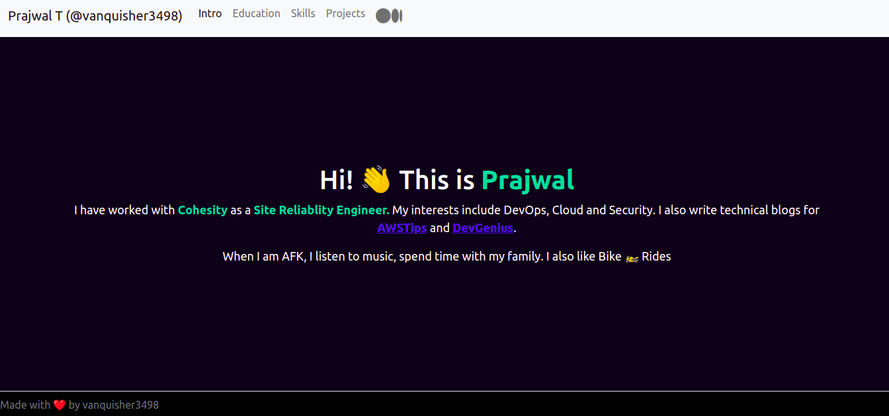
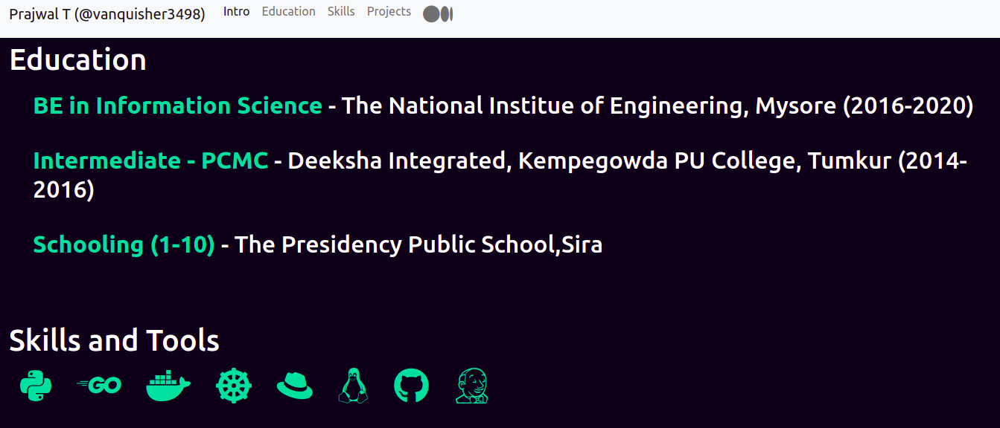
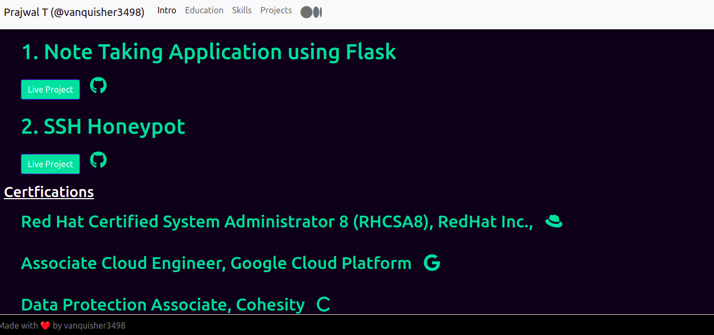

# fportfolio

My personal portfolio website, to keep track of my work and education.

This project is built using Flask and deployed in Heroku.

# Snapshots of the website

## Default page

## Education section

## Projects and Cerification section

